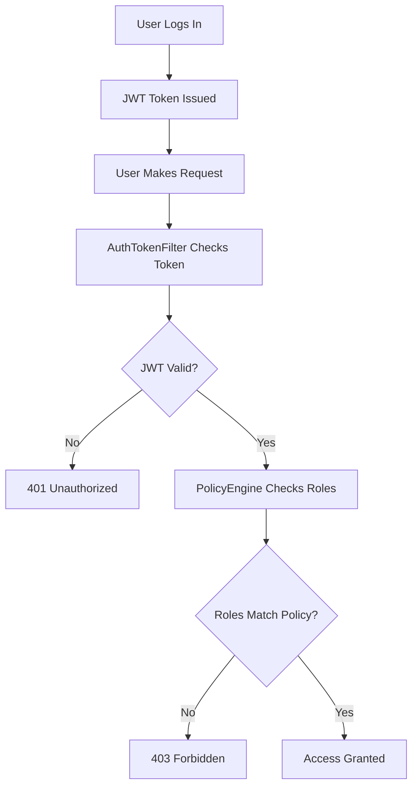
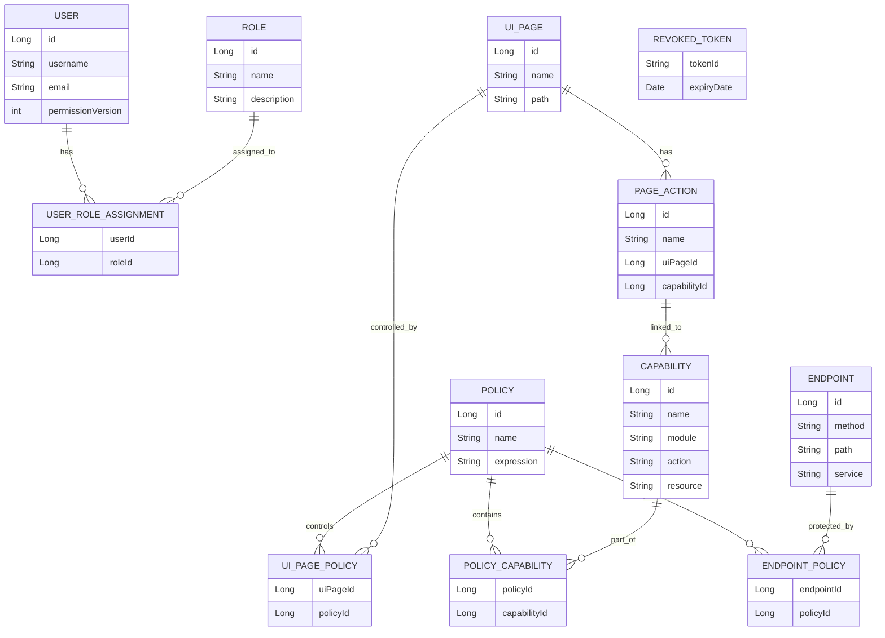
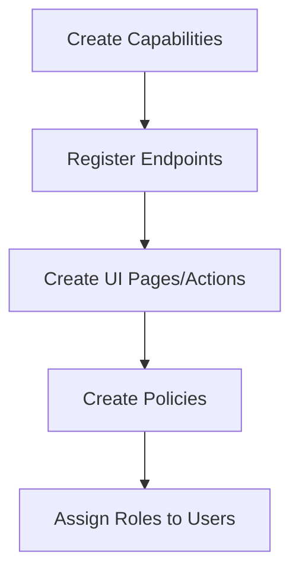
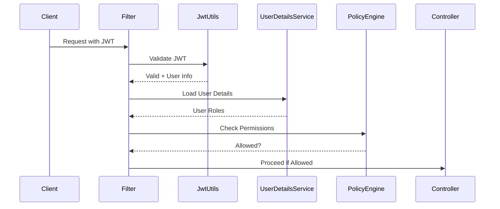

# RBAC Enforcement Setup Guide

This guide walks through the project structure of the auth service and explains, step by step, how to configure and operate the role-based access control (RBAC) stack.

## Overview

Role-Based Access Control (RBAC) is a way to manage who can do what in your application. This auth service uses RBAC to control access to APIs and UI elements based on user roles.

Here's a high-level view of how RBAC works in this system:



In simple terms:
- Users have roles (like "ADMIN" or "USER").
- Roles are linked to policies that define what they can do.
- When a user tries to access something, the system checks if their roles allow it.

## Project Structure Overview

This is a Spring Boot application built with Maven. Here's the key structure:

```
auth-service/
├── Dockerfile              # For containerizing the app
├── pom.xml                 # Maven configuration
├── src/
│   ├── main/
│   │   ├── java/com/example/userauth/
│   │   │   ├── UserAuthServiceApplication.java  # Main app class
│   │   │   ├── config/      # Configuration classes
│   │   │   ├── controller/  # REST API endpoints
│   │   │   ├── dao/         # Data Access Objects
│   │   │   ├── dto/         # Data Transfer Objects
│   │   │   ├── entity/      # JPA Entities (database models)
│   │   │   ├── repository/  # Spring Data Repositories
│   │   │   ├── security/    # Security configurations and filters
│   │   │   └── service/     # Business logic services
│   │   └── resources/       # Application properties and migrations
│   └── test/                # Unit tests
├── docs/                   # Documentation
└── target/                 # Build output
```

## 1. Prerequisites & Environment
- **Java/Spring** – The service targets Java 17 with Spring Boot 3.2 (`pom.xml:8-37`). Build and run with Maven (`mvn spring-boot:run`) once dependencies are installed.
- **Database** – Configure a MySQL schema (default `user_auth_db`) or compatible datasource in `src/main/resources/application-dev.yml:3-25`. RBAC entities rely on JPA/Hibernate with `ddl-auto` typically set to `none` for managed migrations.
- **JWT Secrets** – Supply secure values for `app.jwt.*` in `application.yml:24-41`; these drive token signing and validation.

## 2. Understand the RBAC Data Model

RBAC uses several database tables to store information about users, roles, permissions, etc. Think of it like this:

- **Users**: People who use the system.
- **Roles**: Groups like "Admin" or "Manager" that users can have.
- **Capabilities**: Specific actions, like "read reports" or "create user".
- **Policies**: Rules that say which roles can do which capabilities on which endpoints.
- **Endpoints**: API URLs that need protection.
- **UI Pages/Actions**: Front-end elements that also need permission checks.

Here's how they relate:



Review the entity classes in `src/main/java/com/example/userauth/entity/`:
- `User.java`: Stores user info and a `permissionVersion` that changes when roles are updated.
- `Role.java`: Defines roles like "ADMIN".
- `Capability.java`: Fine-grained permissions (e.g., "CREATE_USER").
- `Policy.java`: Groups capabilities and specifies which roles can access them.
- `Endpoint.java`: API endpoints to protect.
- `UIPage.java` and `PageAction.java`: For UI permissions.
- `RevokedToken.java`: For logout/invalidation.

Make sure your database has tables matching these entities. Use migrations in `src/main/resources/db/migration/`.

## 3. Persistence Layer (Database Access)

The repositories in `src/main/java/com/example/userauth/repository/` handle all database operations. They use Spring Data JPA to make database queries easy.

Key repositories:
- `UserRepository.java`: For user data.
- `RoleRepository.java`: For roles.
- `CapabilityRepository.java`: For permissions, with queries to find capabilities by role.
- `PolicyRepository.java`: For policies, with helpers for role-based lookups.
- `EndpointRepository.java` and `EndpointPolicyRepository.java`: For API endpoints and their policies.

No special setup needed - Spring Boot auto-configures them. Just ensure your database user can read/write the RBAC tables.

## 4. Seed the Authorization Catalog

To make RBAC work, you need to populate the database with roles, capabilities, policies, etc. Use the admin APIs in `src/main/java/com/example/userauth/controller/` (under `/api/admin/**`).

Here's the order to set things up:



### Step-by-Step:

1. **Create Capabilities**  
   POST to `/api/admin/capabilities` (see `CapabilityController.java`).  
   Example: Define actions like "read_user", "create_payment".  
   Body: `{"name": "READ_USER", "module": "USER", "action": "READ", "resource": "USER"}`

2. **Register Endpoints**  
   POST to `/api/admin/endpoints` (`EndpointController.java`).  
   Example: Protect `/api/users` GET.  
   Body: `{"method": "GET", "path": "/api/users", "service": "user-service"}`

3. **Model UI Pages & Actions**  
   POST to `/api/admin/ui-pages` for pages (`UIPageController.java`).  
   POST to `/api/admin/page-actions` for actions (`PageActionController.java`).  
   Link UI elements to capabilities.

4. **Create Policies**  
   POST `/api/admin/policies` (`PolicyController.java`).  
   Example: Allow "ADMIN" and "MANAGER" to read users.  
   Body: `{"name": "User Read Policy", "expression": "{\"roles\": [\"ADMIN\", \"MANAGER\"]}"}`  
   Then assign capability and endpoint IDs to the policy.

5. **Assign Roles to Users**  
   POST `/api/admin/roles` to create roles (`RoleController.java`).  
   POST `/api/admin/roles/assign` to give roles to users.

Start with at least one of each. Empty catalogs will block all access.

## 5. Security Pipeline & JWT Configuration

Security is handled in `src/main/java/com/example/userauth/security/`. Here's how requests are secured:



Key files:
- `EnhancedSecurityConfig.java`: Sets up Spring Security, defines which URLs need protection.
- `AuthTokenFilter.java`: Checks JWT on each request.
- `JwtUtils.java`: Handles JWT creation/validation.
- `AuthEntryPointJwt.java`: Returns 401 errors.
- `SecurityHeadersFilter.java`: Adds security headers.

For method-level security (like `@PreAuthorize`), use `CustomPermissionEvaluator.java`.

Ensure the password encoder in `SecurityConfig.java` matches how passwords are stored.

## 6. Authorization Services & Client-Facing APIs

The business logic for checking permissions is in `src/main/java/com/example/userauth/service/`:
- `AuthorizationService.java`: Gathers user's roles, capabilities, and UI permissions.
- `PolicyEngineService.java`: Checks if user's roles match policy rules.
- `AuthService.java`: Handles login/logout, updates user's permission version when roles change.

Clients (like front-end apps) use these APIs:
- `GET /api/me/authorizations` (`AuthorizationController.java`): Returns user's roles, what they can do, and UI pages they can access.
- `POST /api/auth/login` and `POST /api/auth/logout` (`AuthController.java`): Login issues JWT, logout revokes it.

JWTs include user ID, permission version, and token ID for security.

## 7. Token Invalidation & Caching

To keep things secure:
- When roles change, `AuthService.updateUserPermissions()` bumps the user's `permissionVersion`.
- JWTs include this version; if it doesn't match the database, the token is invalid.
- Logout adds the token ID to `revoked_tokens` table (`TokenBlacklistService.java`).
- Responses use ETags for caching (`SecurityHeadersFilter.java`).

## 8. Validation Checklist

Test that everything works:

1. Set up RBAC data: Create roles, policies, capabilities, endpoints. Make an admin user.
2. Login at `/api/auth/login` – check JWT has `uid`, `pv` (permission version), `jti` (token ID).
3. Call `/api/me/authorizations` with the JWT – should return roles, capabilities, UI pages.
4. Try a protected endpoint – should work if user has the right roles.
5. Change user's role or logout, then try old token – should fail.

Once done, RBAC is fully set up. Keep your setup scripts version-controlled for consistency across environments.
